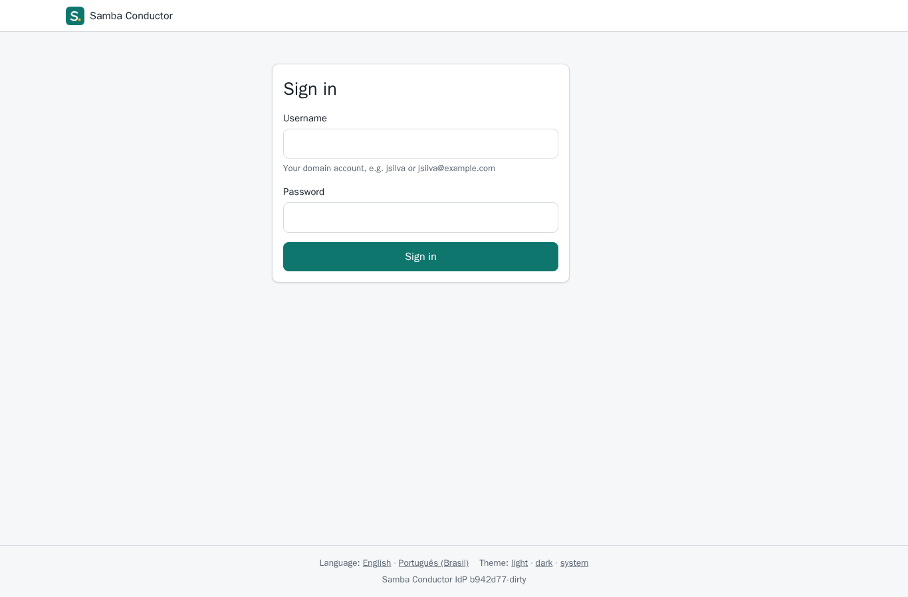
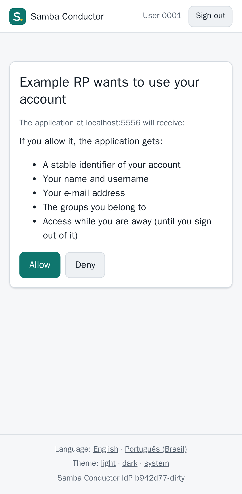
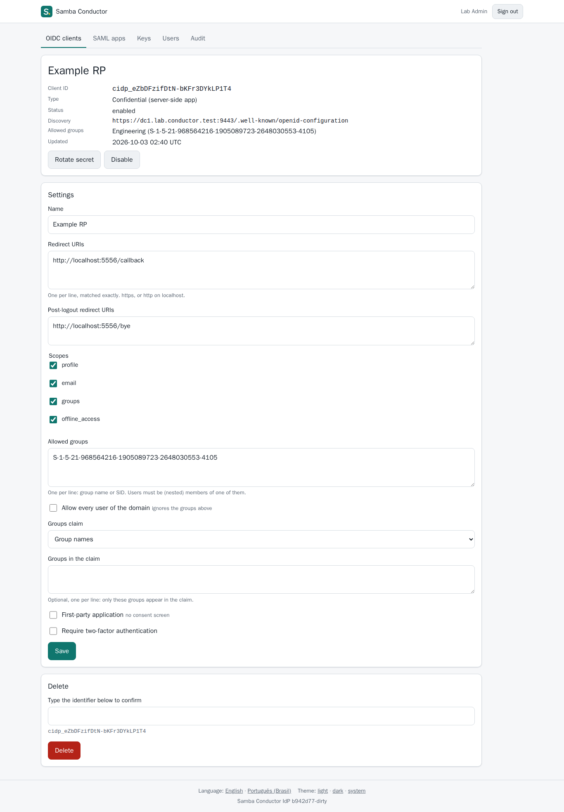
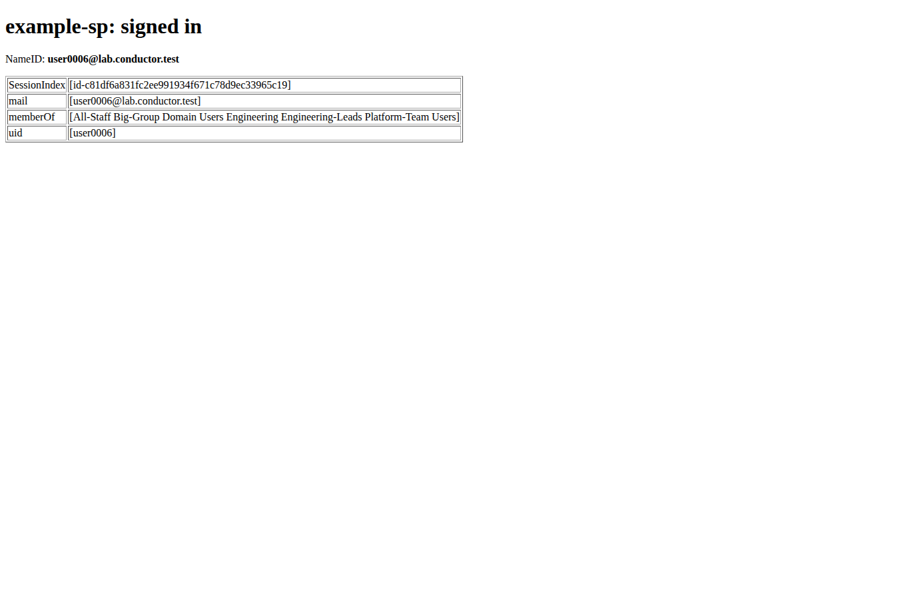

# conductor-idp

OpenID Connect provider and SAML 2.0 identity provider backed by Samba AD.
Part of Samba Conductor v2; design in [docs/design.md](docs/design.md)
and the family's [architecture.md](https://github.com/openbasalt/samba-conductor-docs/blob/main/architecture.md).

Container image: `docker.io/openbasalt/samba-conductor-idp`, tags `0.1.0` and `latest`, also on `ghcr.io/openbasalt` with the same digests, see [containers.md](https://github.com/openbasalt/samba-conductor-docs/blob/main/containers.md).

Status: 0.1.0 released (signed GitHub release `v0.1.0`, APT packages
`0.1.0-1`, container image above). OIDC and SAML validated end to end in
an isolated two-DC lab with an independent OIDC client, Grafana and a
crewjam SAML SP, desktop and mobile ([`docs/usage-p4.md`](docs/usage-p4.md)),
and managed from conductor's Single sign-on section with single logout and
passkeys (conductor's `docs/usage-p4b.md`). The OpenID Foundation
conformance suite's basic and config plans were run locally; results and
the deliberate deviations (PKCE for every client, ES256 only,
`client_secret_basic` only) are in [decisions D13](docs/decisions.md).

| | |
|---|---|
|  |  |
|  |  |

## What it does

- OIDC (zitadel/oidc v3, OpenID certified, on our own SQLite storage):
  Authorization Code + PKCE S256 only (also for confidential clients),
  discovery narrowed to what is served, JWKS with ES256 keys sealed at rest
  and rotated with an overlap, token, userinfo, revocation, end_session.
  Codes single use (reuse revokes what they issued); opaque access tokens;
  refresh tokens hashed, rotated, reuse revokes the chain; every refresh
  re-checks the account and its groups in AD.
- SAML 2.0 (crewjam/saml): SP- and IdP-initiated SSO, signed response
  and assertion, optional encryption, metadata, per-SP NameID, attribute
  mapping and allowed groups; SP data only from the admin registry,
  request IDs answered once, staged signing-key rotation.
- AD: passwords verified with Kerberos (simple bind fallback when
  configured) and never kept; bind sub-codes handled (expired and
  must-change go to a change page that needs the old password; locked,
  disabled, expired get a clear message); claims and policy read with a
  read-only service account; `sub` = objectGUID; `groups` by name or SID,
  nested.
- Clients and SPs registered by administrators: CLI
  (`conductor-idp client|saml …`) and admin pages; exact redirect URIs,
  allowed AD groups by SID, scopes, consent (first-party skip), optional
  mandatory 2FA per client.
- SAML single logout: signed HTTP-Redirect LogoutRequests from registered
  SPs, a confirmation for anything else, a signed chain to the other SPs
  of the session; IdP- and OIDC-initiated logouts reach them too.
- 2FA: TOTP + recovery codes, mandatory for administrators (enrolled
  through a one-time link), `off/optional/required` for others. On
  conductor's host, conductor's 2FA instead (one enrollment and one policy
  for both, security keys and passkeys included, through conductor's local
  socket; docs/decisions.md D4).
- Managed from conductor's "Single sign-on" section through a local
  management API (clients, SPs with presets and metadata import, previews,
  keys, settings, activity), or with the CLI and its own admin pages,
  which can have a listener of their own on an internal network (the
  public listener then answers 404 for them) or be turned off
  (`server.admin_listen`, docs/decisions.md D14).
- Security: no JavaScript except the WebAuthn script on the second-factor
  page (CSP nonce + SRI; `script-src 'none'` everywhere else, form-action
  limited to the flow's own targets), CSRF tokens + Fetch metadata,
  `__Host-` cookies, rate limits per address and per account, audit log,
  systemd sandbox, i18n en + pt-BR, `data-e2e` everywhere.
- Audit log: SQLite table the service only appends to, with a hash chain
  (`conductor-idp audit verify`) that detects accidental or partial edits. It
  is not keyed or anchored outside the database, so it does not protect
  against someone with write access to the database file. Protect the
  database file and ship the exported log off the host if you need tamper
  evidence.

## Documentation

- [Install and operate](docs/install.md) (config reference: [`idp.toml.example`](idp.toml.example))
- [Install on Basalt OS / Fedora (RPM, SELinux)](docs/install-fedora.md)
- [Decisions](docs/decisions.md)
- [Lab run](docs/usage-p4.md) and [screenshots](docs/screenshots/)

## Development

```sh
make check                      # gofmt, vet, staticcheck, govulncheck, go test -race
make build                      # bin/conductor-idp (CGO off, static)
make package                    # dist/: .deb for amd64 and arm64, SBOMs
make lintian                    # Debian 13's lintian on dist/*.deb
scripts/lab-deploy.sh [--snapshot]   # build on the lab host, install on the idp lab's dc1
e2e/run-lab.sh [desktop|mobile]      # Playwright suite on the lab host
```

| Path | What |
|---|---|
| `cmd/conductor-idp` | `serve`, `client`, `saml`, `keys`, `enroll-link`, `mfa reset`, `audit`, `gen-key`, `check` |
| `cmd/example-rp`, `cmd/example-sp` | test relying parties (OIDC, SAML) for the lab |
| `internal/oidcp` | op storage, keys, provider, claims |
| `internal/samlidp` | SAML IdP on crewjam, SAML keys |
| `internal/web` | pages, flows, admin, middleware, sessions |
| `internal/directory` | AD access through `ad` (user sign-in, service account) |
| `internal/mfa` | local TOTP backend, conductor socket client (TOTP, security keys) |
| `internal/api`, `idpapi` | management API server and its public protocol (also the 2FA socket protocol conductor serves) |
| `internal/store` | SQLite state, migrations, audit chain |
| `internal/registry` | validation of client and SP registrations |
| `deploy/systemd` | unit |
| `e2e`, `scripts/lab` | Playwright suite, lab install |

The module is `github.com/openbasalt/samba-conductor-idp`; it imports the `ad`
library (`github.com/openbasalt/samba-conductor-ad`) at the version `go.mod`
pins; a Go workspace builds against a local copy instead
([CONTRIBUTING.md](CONTRIBUTING.md)).

License: Apache-2.0 ([LICENSE](LICENSE), [NOTICE](NOTICE)).
