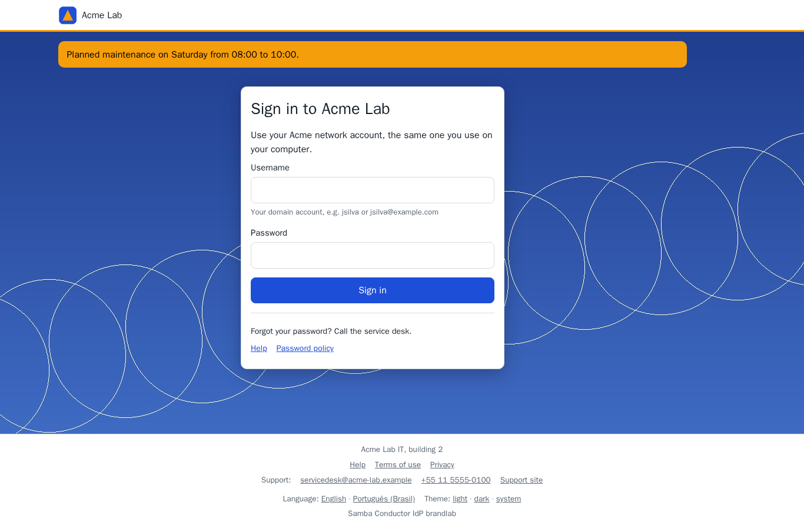
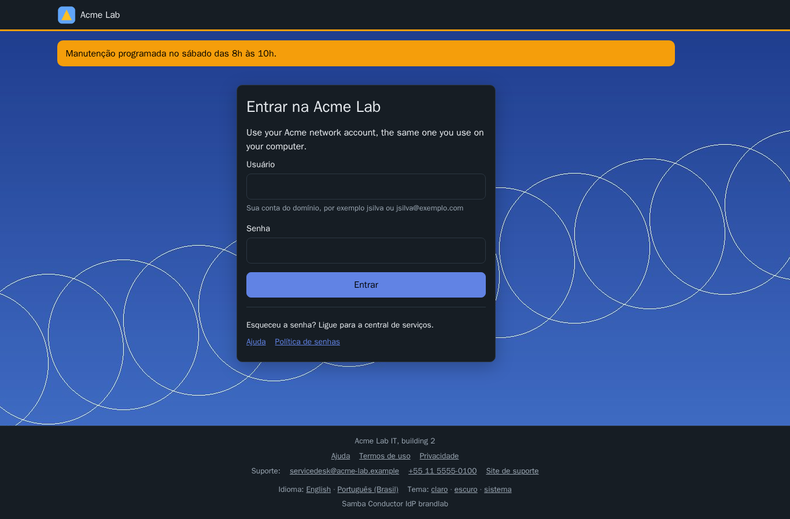

# Branding of the sign-in pages

The pages users see at conductor-idp (sign-in, second factor, enrollment,
password change, consent, logout and error pages) can carry the
organization's look, so that a user going from an application to the
sign-in page and to conductor's self-service portal stays in one visual
identity. The admin pages, the admin listener and the OpenID Connect and
SAML endpoints always keep the product look. Decisions: D15 in
[decisions.md](decisions.md).



## Level 1: edited in conductor

Organization name, logos (light and dark theme), favicon, sign-in
background image, primary and accent colors, texts per language (sign-in
title and note, help text, footer, notice banner), support contact
(e-mail, phone, site) and links (help, terms, privacy, password policy)
are edited in conductor, Settings > Branding, previewed, saved as a
version with the administrator's password and a fresh second factor, and
pushed here through the management API (`branding.update`). conductor-idp
checks the document and every image again, stores them in its database and
applies them at once; the update is in its audit chain with the acting
administrator. Restoring an older version in conductor pushes it the same
way. How to edit it: conductor's
[branding.md](https://github.com/openbasalt/samba-conductor/blob/main/docs/branding.md).

What the pages get:

| Where | What |
|---|---|
| Header | logo (the dark-theme logo in the dark theme), organization name, a line in the accent color |
| Every page | favicon, the notice banner, the colors (buttons, links, focus) in both themes |
| Sign-in page | its title and note, the help text, links to the help page and the password policy, the background image |
| Second factor, enrollment, password change, logout | the background image; the password policy link on the password change page |
| Footer | footer text, help, terms and privacy links, support e-mail, phone and site |

Texts fall back per field to English, then to the other language, so a
text written in one language only still shows. The consent screen note is
a single sign-on setting (conductor, Single sign-on > Policy).



Colors are CSS custom properties in a generated stylesheet,
`/branding/theme.css`; images are served from `/branding/assets/<sha256>`.
Both come from this origin, so the Content Security Policy stays as it is
(no inline style or script). A primary color that does not reach a
contrast of 4.5:1 on the light background is refused; the dark theme uses
a lighter shade of it automatically. SVG images are refused.

## Level 2: template overrides

`[branding] templates_dir` names a directory whose files replace
built-in partials of the user-facing pages:

| File | Partial | Contract (must stay in the rendered output) |
|---|---|---|
| `header.html` | `brand-header` | `data-e2e="nav-link-home"` linking to `/`; for a signed-in user the sign-out form (`action="/logout"`, the `csrf` field, `data-e2e="nav-btn-signout"`) |
| `footer.html` | `brand-footer` | the language and theme links (`footer-link-lang-en`, `footer-link-lang-pt-br`, `footer-link-theme-light`, `-dark`, `-system`) |
| `signin-box.html` | `signin-box` | the form posting to `/login` with the fields `csrf`, `c`, `enroll`, `username` and `password`, their labels, `signin-input-username`, `signin-input-password`, `signin-btn-submit` and the error (`form-text-error`) |
| `custom.css` | | an optional stylesheet loaded after the generated one |

`conductor-idp templates list` prints the partials and their contract;
`conductor-idp templates show NAME` prints a built-in partial with the
header line to start an override from:

```
{{/* samba-conductor template signin-box.html base=d4d8ae4e1de48bd6 */}}
```

The `base` hash names the built-in body the override was written against.
After an upgrade, `conductor-idp templates check` (also run by
`conductor-idp check`, and logged at startup) reports every override whose
built-in partial changed, so it can be compared with the new one; it exits
with an error then, and when an override is refused.

Rules:

- A file is a template body, not a definition: Go html/template with
  auto-escaping, the same functions as the built-in pages (`t` for
  translated messages, `pref`, `e2e`). `{{define}}` and `{{block}}` are
  refused.
- Refused (the built-in partial stays, with a warning): `<script>`,
  embedded documents (`<iframe>`, `<object>`, `<embed>`), `<base>`,
  `<link>`, `<meta>`, `<style>`, `style` attributes, event handler
  attributes, `javascript:`, `vbscript:` and `data:` URLs, the script nonce,
  forms that post to another site, a broken contract, an image without
  `alt`, an image from another origin that is not allowlisted, a file over
  64 KiB, a file that does not parse or render.
- `custom.css` may not use `@import`, `expression()`, script URLs or
  `data:` URLs; its `url()` references stay on this origin or an
  allowlisted one.
- Images and fonts from another origin need it in
  `[branding] allowed_origins`; it is added to `img-src` and `font-src` of
  the branded pages only.
- An override that renders with the check's sample data but fails on a
  real page is replaced by the built-in partial for that response, with a
  warning in the log.
- The files are read at startup: restart the service after a change.

The data a partial sees is the page's: `.Lang`, `.User` (`.Name`, `.SAM`),
`.CSRF`, `.Query`, `.Version`, `.Product`, `.D` (the page's own data) and
`.B`, the branding:

| Field | Content |
|---|---|
| `.B.Name` | organization name (the product name when none is set) |
| `.B.LogoLight`, `.B.LogoDark` | image URLs (empty: no logo) |
| `.B.Favicon`, `.B.FaviconType` | favicon URL and type |
| `.B.Background` | a sign-in background image is set |
| `.B.SignInTitle`, `.B.SignInNote`, `.B.Help`, `.B.Footer`, `.B.Notice` | texts in the page's language |
| `.B.SupportEmail`, `.B.SupportMailto`, `.B.SupportPhone`, `.B.SupportTel`, `.B.SupportURL` | support contact and its links |
| `.B.HelpURL`, `.B.TermsURL`, `.B.PrivacyURL`, `.B.PolicyURL` | links (https, mailto: or tel:) |
| `.B.HasSupport`, `.B.HasLinks` | whether those blocks have content |

`.B` is set on every user-facing page once a branding or an override
exists; partials are only used then, so `.B` is never empty inside them.
